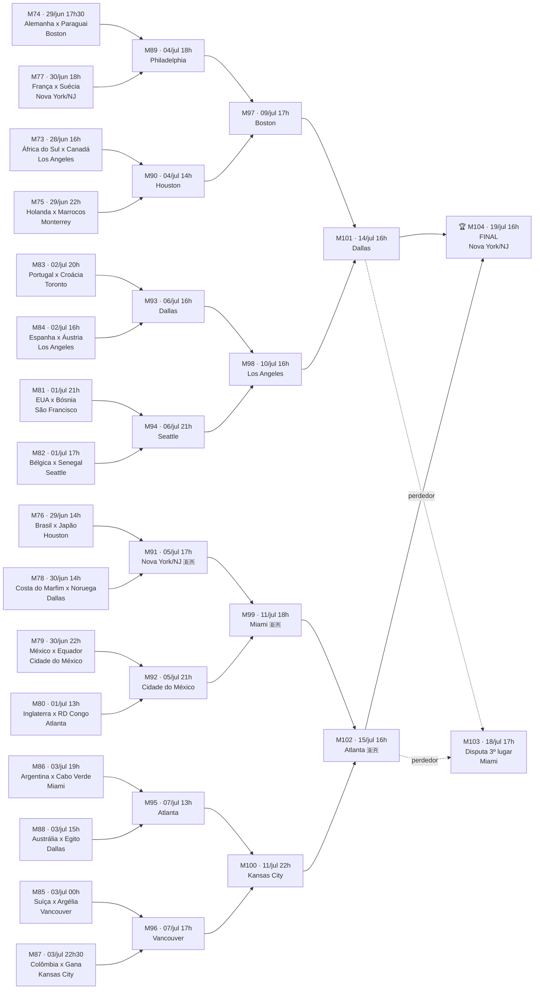

# Chaveamento do Mata-Mata — Copa do Mundo 2026

> Horários em **Brasília (BRT)**. Convertidos a partir do horário oficial ET (leste dos EUA), somando 1 hora.
> Datas e estádios das quartas em diante já são fixos; os times serão preenchidos conforme os resultados.

## Linha do tempo das fases

```
16-avos (Round of 32)  →  28/jun a 03/jul
Oitavas (Round of 16)  →  04/jul a 07/jul
Quartas de final       →  09/jul a 11/jul
Semifinais             →  14/jul e 15/jul
Disputa de 3º lugar    →  18/jul
Final                  →  19/jul  (MetLife Stadium, Nova Jersey)
```

## Diagrama do chaveamento (Mermaid)



🇧🇷 = jogos que fazem parte do caminho do Brasil (Grupo C, 1º colocado) até a decisão, caso avance em cada fase.

## Resumo por fase (tabela rápida)

### 16-avos de final
| # | Data | Hora (BRT) | Confronto | Cidade | Estádio |
|---|------|-----------|-----------|--------|---------|
| 73 | 28/06 | 16:00 | África do Sul x Canadá | Los Angeles | SoFi Stadium |
| 76 | 29/06 | 14:00 | Brasil x Japão | Houston | NRG Stadium |
| 74 | 29/06 | 17:30 | Alemanha x Paraguai | Boston | Gillette Stadium |
| 75 | 29/06 | 22:00 | Holanda x Marrocos | Monterrey | Estadio BBVA |
| 78 | 30/06 | 14:00 | Costa do Marfim x Noruega | Dallas | AT&T Stadium |
| 77 | 30/06 | 18:00 | França x Suécia | Nova York/NJ | MetLife Stadium |
| 79 | 30/06 | 22:00 | México x Equador | Cidade do México | Estádio Azteca |
| 80 | 01/07 | 13:00 | Inglaterra x RD Congo | Atlanta | Mercedes-Benz Stadium |
| 82 | 01/07 | 17:00 | Bélgica x Senegal | Seattle | Lumen Field |
| 81 | 01/07 | 21:00 | EUA x Bósnia e Herzegovina | São Francisco | Levi's Stadium |
| 84 | 02/07 | 16:00 | Espanha x Áustria | Los Angeles | SoFi Stadium |
| 83 | 02/07 | 20:00 | Portugal x Croácia | Toronto | BMO Field |
| 85 | 02/07 | 00:00* | Suíça x Argélia | Vancouver | BC Place |
| 88 | 03/07 | 15:00 | Austrália x Egito | Dallas | AT&T Stadium |
| 86 | 03/07 | 19:00 | Argentina x Cabo Verde | Miami | Hard Rock Stadium |
| 87 | 03/07 | 22:30 | Colômbia x Gana | Kansas City | Arrowhead Stadium |

\* madrugada de 03/07 no horário de Brasília.

### Oitavas de final
| # | Data | Hora (BRT) | Confronto | Cidade |
|---|------|-----------|-----------|--------|
| 90 | 04/07 | 14:00 | Vencedor 73 x Vencedor 75 | Houston |
| 89 | 04/07 | 18:00 | Vencedor 74 x Vencedor 77 | Philadelphia |
| 91 | 05/07 | 17:00 | Vencedor 76 x Vencedor 78 (Brasil x Noruega) | Nova York/NJ |
| 92 | 05/07 | 21:00 | Vencedor 79 x Vencedor 80 | Cidade do México |
| 93 | 06/07 | 16:00 | Vencedor 83 x Vencedor 84 | Dallas |
| 94 | 06/07 | 21:00 | Vencedor 81 x Vencedor 82 | Seattle |
| 95 | 07/07 | 13:00 | Vencedor 86 x Vencedor 88 | Atlanta |
| 96 | 07/07 | 17:00 | Vencedor 85 x Vencedor 87 | Vancouver |

### Quartas de final
| # | Data | Hora (BRT) | Confronto | Cidade |
|---|------|-----------|-----------|--------|
| 97 | 09/07 | 17:00 | Vencedor 89 x Vencedor 90 | Boston |
| 98 | 10/07 | 16:00 | Vencedor 93 x Vencedor 94 | Los Angeles |
| 99 | 11/07 | 18:00 | Vencedor 91 x Vencedor 92 | Miami |
| 100 | 11/07 | 22:00 | Vencedor 95 x Vencedor 96 | Kansas City |

### Semifinais
| # | Data | Hora (BRT) | Confronto | Cidade |
|---|------|-----------|-----------|--------|
| 101 | 14/07 | 16:00 | Vencedor 97 x Vencedor 98 | Dallas |
| 102 | 15/07 | 16:00 | Vencedor 99 x Vencedor 100 | Atlanta |

### Disputa de 3º lugar e Final
| # | Data | Hora (BRT) | Confronto | Cidade |
|---|------|-----------|-----------|--------|
| 103 | 18/07 | 17:00* | Perdedor 101 x Perdedor 102 | Miami |
| 104 | 19/07 | 16:00 | Vencedor 101 x Vencedor 102 | Nova York/NJ (MetLife Stadium) |

\* algumas fontes indicam 18h em vez de 17h para a disputa de 3º lugar — vale confirmar no site oficial da FIFA perto da data.

---
**Fontes cruzadas:** Wikipédia (estrutura oficial do chaveamento e números de partida), Sky Sports, ESPN, worldcuppass.com (datas/horários/estádios do Round of 32 em diante), e reportagens que confirmam o caminho do Brasil.
